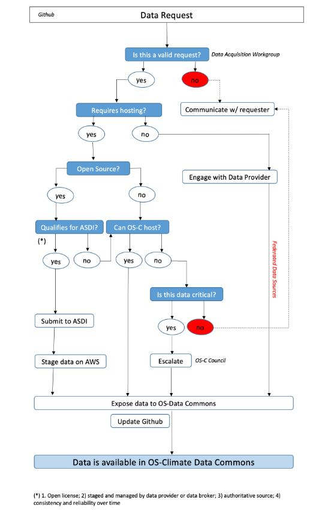

<!-- markdownlint-disable -->
<!-- prettier-ignore-start -->
> [!IMPORTANT]
> On June 26 2024, Linux Foundation announced the merger of its financial services umbrella, the Fintech Open Source Foundation ([FINOS](https://finos.org)), with OS-Climate, an open source community dedicated to building data technologies, modeling, and analytic tools that will drive global capital flows into climate change mitigation and resilience; OS-Climate projects are in the process of transitioning to the [FINOS governance framework](https://community.finos.org/docs/governance); read more on [finos.org/press/finos-join-forces-os-open-source-climate-sustainability-esg](https://finos.org/press/finos-join-forces-os-open-source-climate-sustainability-esg)
<!-- prettier-ignore-end -->
<!-- markdownlint-enable -->

# Data-Requests
## Dataset Request Tracker

When filling out issues for newly requested datasets, please be sure to always include links to reference documentation about the dataset.  Such reference documentation should explain not only the schema of the dataset, but its history, usage, caveats, etc.  If the dataset is part of a regulatory framework, the reference documentation should explain that as well.  This documentation is **vital** to helping to document the data through the Data Commons Browser and deciding how to publish the data.

